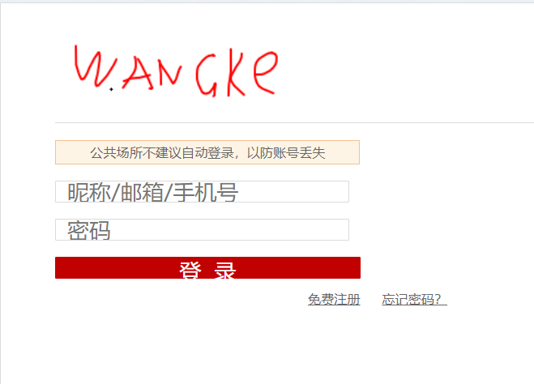
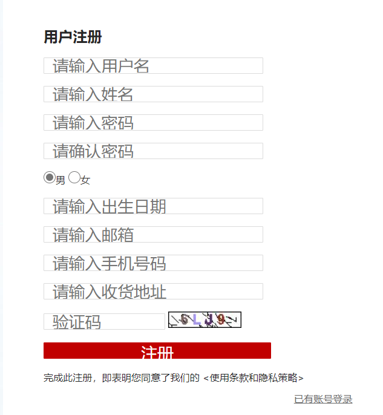
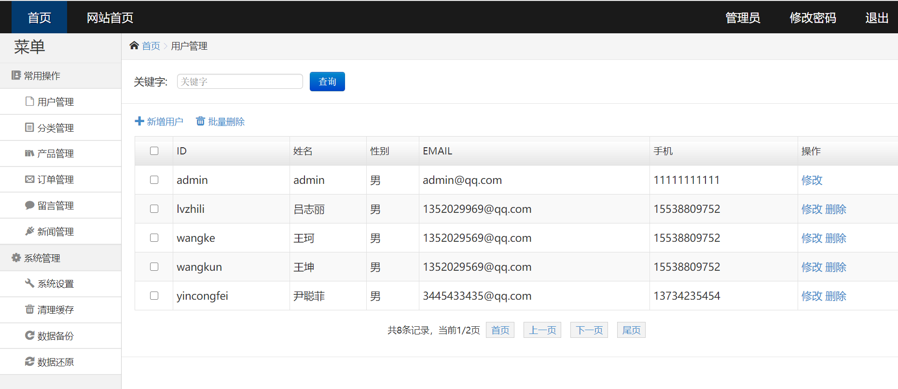
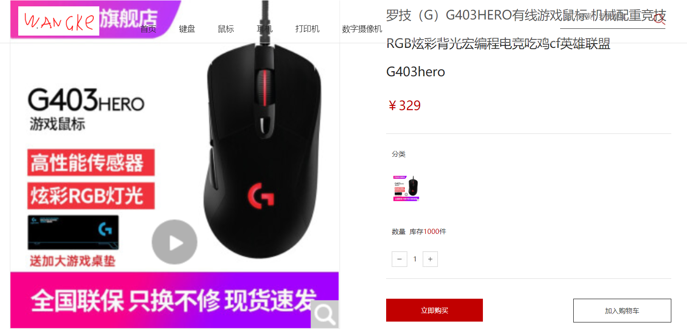

# 基于MVC设计模式的电子商城项目的设计与实现

## 项目背景

此项目是一个基于MVC设计模式的电子商城项目，目的是用来把学习过的知识加以整合运用。前端页面是在网上找到的html模板，后端所有代码为自己所写。项目还未彻底完善好，后期还会继续完善。

- 项目所用的语言：Java+html+css+JavaScript

- 运用的技术有：Ajax，EL，JSTL，JSP，servlet，jdbc，filter
- 开发环境：IDEA，SQLyog，VSCode，Chrome
- 服务器：Tomcat
- JDK版本：jdk 1.8
- 数据库：mysql

## 项目已实现功能

### 前台用户功能

- 注册
- 登录
- 查看个人信息
- 搜索商品
- 查看商品列表
- 查看商品详情
- 添加购物车
- 查看购物车
- 对购物车中的商品进行操作
- 结账

### 后台管理员功能

- 对用户进行增删改查
- 对商品进行增删改查
- 对商品列表进行增删改查

## 项目未实现功能(完善中)

### 前台用户未实现功能

- 修改个人信息
- 添加和修改收货地址
- 查询订单状态
- 对商品进行评论
- 收藏商品
- 商品排序

### 后台管理员未实现功能

- 对评价进行增删改查
- 对订单状态进行更新

## 项目运行截图

1. 登录界面

   

2. 注册界面

   

3. 后台管理员界面

   

4. 商品详情页

   

## 项目结构

```
├─.idea
│  ├─artifacts
│  └─libraries
├─out
│  ├─artifacts
│  │  └─Shop_war_exploded
│  │      ├─css
│  │      ├─images
│  │      │  ├─product
│  │      │  └─wzxx
│  │      ├─img
│  │      │  └─temp
│  │      ├─js
│  │      ├─manage
│  │      │  ├─css
│  │      │  ├─fonts
│  │      │  └─images
│  │      │      └─login
│  │      └─WEB-INF
│  │          ├─classes
│  │          │  └─pers
│  │          │      └─wangke
│  │          │          └─shop
│  │          │              ├─dao
│  │          │              ├─filter
│  │          │              ├─pojo
│  │          │              ├─servlet
│  │          │              │  ├─admin
│  │          │              │  ├─cart
│  │          │              │  ├─cate
│  │          │              │  ├─home
│  │          │              │  ├─product
│  │          │              │  └─user
│  │          │              └─utils
│  │          └─lib
│  └─production
│      └─Shop
│          └─pers
│              └─wangke
│                  └─shop
│                      ├─dao
│                      ├─filter
│                      ├─pojo
│                      ├─servlet
│                      │  ├─admin
│                      │  ├─cart
│                      │  ├─cate
│                      │  ├─home
│                      │  ├─product
│                      │  └─user
│                      └─utils
├─src
│  └─pers
│      └─wangke
│          └─shop
│              ├─dao
│              ├─filter
│              ├─pojo
│              ├─servlet
│              │  ├─admin
│              │  ├─cart
│              │  ├─cate
│              │  ├─home
│              │  ├─product
│              │  └─user
│              └─utils
└─web
    ├─css
    ├─images
    │  ├─product
    │  └─wzxx
    ├─img
    │  └─temp
    ├─js
    ├─manage
    │  ├─css
    │  ├─fonts
    │  ├─images
    │  │  └─login
    │  └─js
    └─WEB-INF
        └─lib
```

#### 项目文件说明-数据库文件

```
shop.sql
```

#### 项目文件说明-项目压缩文件

```
Shop.zip
```


